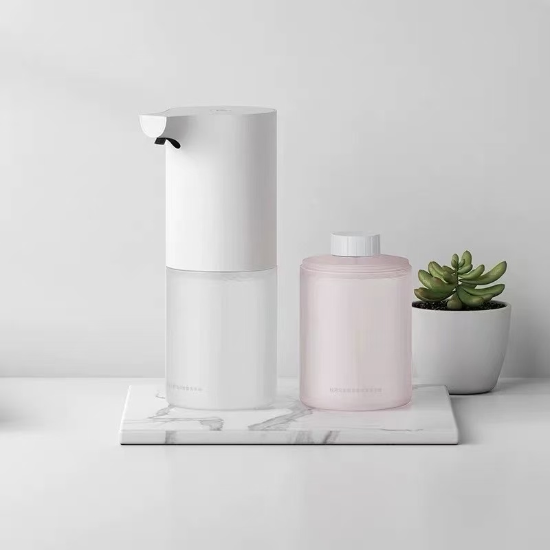
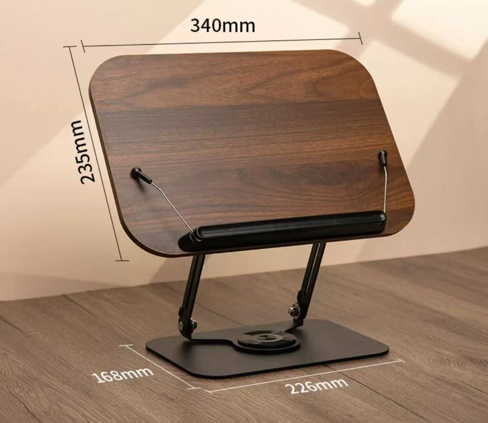

## 那我们就随便英文聊聊吧

## 讨论第一集的主题

## 节目中推荐的产品
自动皂液器

笔记本电脑支架

## 需要改进的地方

### 试着把下面的中文翻译为英文
1. 有许多我想讨论的主题
2. 我选择几个，你选择几个。然后我们再从中看讨论哪个主题
3. 我认为大部分人对个人话题更感兴趣。
4. 对不起，你之前提到的第一个话题是什么？
5. 对不起，我使你误会了。
6. 雅思（IETS）的全称
7. 另一类是国外生活的话题，比如：找学车教练
8. 我们每人选择一个话题
9. 今天的内容够了

