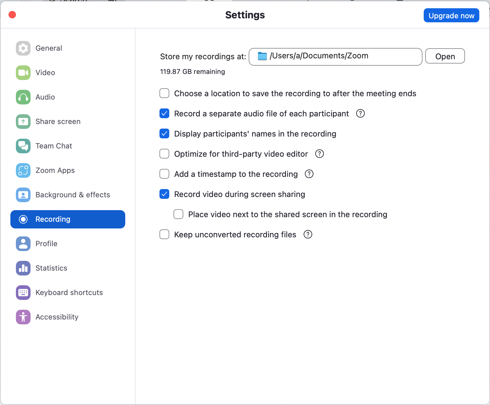

Podcast [Web Design Business with Josh Hall](https://joshhall.co)

## Record software: Zoom
1. Need use vpn in china to join
2. Support record audio for different participants. settings -> recording
3. Can share with computer audio, which enables play bg music in pc.
   1. we can use it to capture audio from pc to make bg music

## Why we need record seperate audio file for each participant
After 1 round of chat, we need translate some part to more fluent english expression in 2 round. Each participant is responsible for translating their own part.

## Record software: Tecent meeting/voov
腾讯会议海外版voov可以支持国内和国外会议连接，并且可以录制

## 专辑
通过英文交流的形式，分享我们的生活故事，同时提高英文口语和听力水平。

每个聊天话题分两集录制。  
第一集就一个话题用英文轻松聊天，分享我们的生活故事。  
第二集通过对第一集聊天过程的英文部分进行反思，纠正，重新录制一遍。
这里是我们的英文聊聊“吧”。

## 喜马拉雅
喜马拉雅支持把专辑发布到Apple Podcast上  
https://studio.ximalaya.com/lab  

### RSS
https://www.ximalaya.com/album/86658945.xml

## Apple Podcast Connect
https://podcastsconnect.apple.com/my-podcasts

## 将节目插入微信公众号，（公众号菜单或文章中）
https://m.ximalaya.com/gatekeeper/mp-anchor-guide