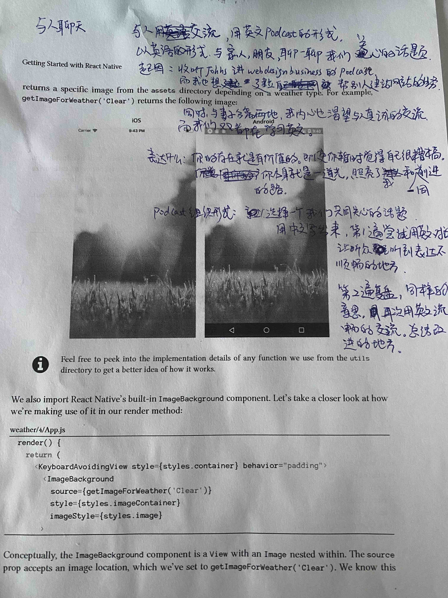

Podcast [Web Design Business with Josh Hall](https://joshhall.co)

## Record software: Zoom
1. Need use vpn in china to join
2. Support record audio for different participants. settings -> recording
3. Can share with computer audio, which enables play bg music in pc.
   1. we can use it to capture audio from pc to make bg music

## Why we need record seperate audio file for each participant
After 1 round of chat, we need translate some part to more fluent english expression in 2 round. Each participant is responsible for translating their own part.
