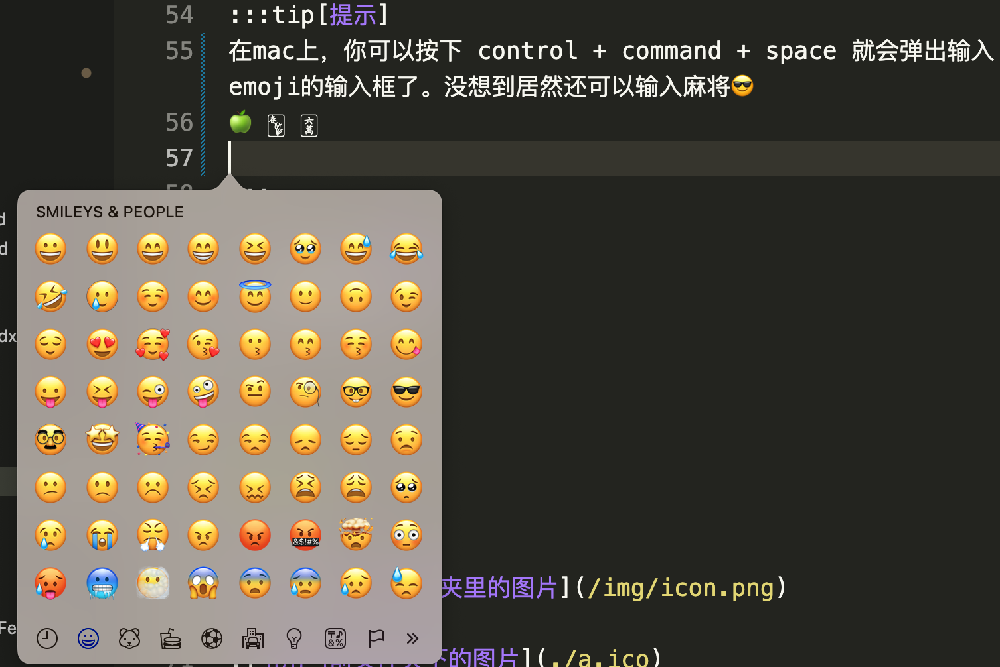
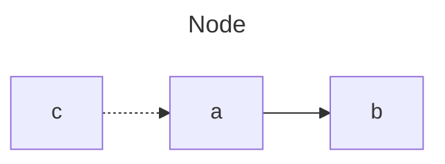

# Markdown 常用语法

## 换行
在尾巴后，加上两个空格就可以换行啦

```md
这句话比较长  
我需要换行
```
## 分段
两段之间加一个空行
```md
我是第一段

俺是第二段
```

## 标题

```md
# 一级标题很显眼
## 二级标题也突出
### 三级标题惹人爱
```

## 块引用

> 这是大石块
>> 小石块

```md
> 这是大石块
>> 小石块
```


## md block

```md
厚德载物
```

````md
```md
厚德载物
```
````

## 提示

:::tip[提示]
在mac上，你可以按下 control + command + space 就会弹出输入emoji的输入框了。没想到居然还可以输入麻将😎
🍏 🀦 🀌
:::

:::danger[告警]
出门记得关灯啊
:::

```md
:::tip[提示]
在mac上，你可以按下 control + command + space 就会弹出输入emoji的输入框了。没想到居然还可以输入麻将😎
🍏 🀦 🀌

:::

:::danger[告警]
出门记得关灯啊

:::
```

## 图片

```md



```


## 代码块

```jsx title="src/components/example.jsx"
function hello() {
    return <h1>Hello Markdown</hi>
}
```

````md
```jsx title="src/components/example.jsx"
function hello() {
    return <h1>Hello Markdown</hi>
}
```
````

## 自定义块样式
:::danger
下面的样式在Markdown里是可以用的，但是 Docusaurus里会报错
:::
```html
<blockquote style="border-left: 5px solid #409eff; background-color: #ecf5ff; padding: 10px;">
这是大石块
</blockquote>
```
在 Docusaurus中, Markdown 文件是以 MDX (Markdown + JSX)形式处理的，所以需要按照 JSX 的语法来定义样式。
把上面的定义改写成下面的代码，就可以了。

````jsx
<blockquote style={{borderLeft: '5px solid #409eff', backgroundColor: '#ecf5ff', padding: '10px'}}>
这是大石块
</blockquote>
````

<blockquote style={{borderLeft: '5px solid #409eff', backgroundColor: '#ecf5ff', padding: '10px'}}>
这是大石块
</blockquote>


## 画图


