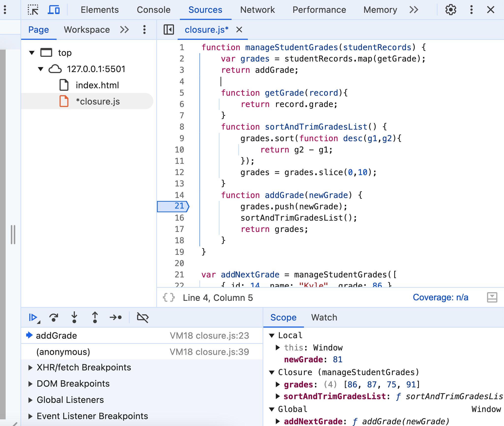

# You don't know JS

:::tip
[github book link](https://github.com/getify/You-Dont-Know-JS/)
:::

## Chapter 4
### Around the Global Scope
#### Globals Shadowing Globals
The difference between following two code snippets.

```javascript
window.something=12
let something=13

window.something=12
var something=13
```
#### DOM Globals

One surprising behavior in the global scope you may encounter with browser-based JS applications: a DOM element with an id attribute automatically creates a global variable that references it.

Consider this markup:

```md
<ul id="my-todo-list">
   <li id="first">Write a book</li>
   ..
</ul>
```
And the JS for that page could include:

```md
first;
// <li id="first">..</li>

window["my-todo-list"];
// <ul id="my-todo-list">..</ul>
```

#### What's in a (Window) Name?

```md
var name = 42;

console.log(name, typeof name);
// "42" string
```

But the truly surprising behavior is that even though we assigned the number 42 to name (and thus window.name), when we then retrieve its value, it's a string "42"! In this case, the weirdness is because name is actually a pre-defined getter/setter on the window object, which insists on its value being a string value. Yikes!

#### Web Workers
Web Workers are a web platform extension on top of browser-JS behavior, which allows a JS file to run in a completely separate thread (operating system wise) from the thread that's running the main JS program.

Since these Web Worker programs run on a separate thread, they're restricted in their communications with the main application thread, to avoid/limit race conditions and other complications. Web Worker code does not have access to the DOM, for example. Some web APIs are, however, made available to the worker, such as navigator.

In a Web Worker, the global object reference is typically made using self:

```javascript
var studentName = "Kyle";
let studentID = 42;

function hello() {
    console.log(`Hello, ${ self.studentName }!`);
}

self.hello();
// Hello, Kyle!

self.studentID;
// undefined
```

#### Node

```javascript
global.studentName = "Kyle";

function hello() {
    console.log(`Hello, ${ studentName }!`);
}

hello();
// Hello, Kyle!

module.exports.hello = hello;
```

#### Others
```javascript
const theGlobalScopeObject =
    (new Function("return this"))();
```

```javascript
const theGlobalScopeObject =
    (typeof globalThis != "undefined") ? globalThis :
    (typeof global != "undefined") ? global :
    (typeof window != "undefined") ? window :
    (typeof self != "undefined") ? self :
    (new Function("return this"))();
```

## Chapter 5: The (Not So) Secret Lifecycle of Variables

### Hoisting: Declaration vs. Expression
A function declaration is hoisted and initialized to its function value (again, called function hoisting). A var variable is also hoisted, and then auto-initialized to undefined. Any subsequent function expression assignments to that variable don't happen until that assignment is processed during runtime execution.

```javascript
greeting();
// TypeError

var greeting = function greeting() {
    console.log("Hello!");
};
```

```javascript
greeting = "Hello!";
console.log(greeting);
// Hello!

var greeting = "Howdy!";
```

### Re-declaration?

```javascript
var studentName = "Frank";
console.log(studentName);
// Frank

var studentName;
console.log(studentName);   // ???
```
hoisting is actually about registering a variable at the beginning of a scope

```javascript
var studentName = "Frank";
console.log(studentName);   // Frank

var studentName;
console.log(studentName);   // Frank <--- still!

// let's add the initialization explicitly
var studentName = undefined;
console.log(studentName);   // undefined <--- see!?
```

```javascript
var greeting;

function greeting() {
    console.log("Hello!");
}

// basically, a no-op
var greeting;

typeof greeting;        // "function"

var greeting = "Hello!";

typeof greeting;        // "string"
```

```javascript
let studentName = "Frank";

var studentName = "Suzy"; // SyntaxError
```

### Loop

```javascript
var keepGoing = true;
while (keepGoing) {
    let value = Math.random();
    if (value > 0.5) {
        keepGoing = false;
    }
}
```
All the rules of scope (including "re-declaration" of let-created variables) are applied per scope instance. In other words, each time a scope is entered during execution, everything resets.

Each loop iteration is its own new scope instance, and within each scope instance, value is only being declared once.


```javascript
for (let i = 0; i < 3; i++) {
    let value = i * 10;
    console.log(`${ i }: ${ value }`);
}
// 0: 0
// 1: 10
// 2: 20
```

equivalent form

```javascript
{
    // a fictional variable for illustration
    let $$i = 0;

    for ( /* nothing */; $$i < 3; $$i++) {
        // here's our actual loop `i`!
        let i = $$i;

        let value = i * 10;
        console.log(`${ i }: ${ value }`);
    }
    // 0: 0
    // 1: 10
    // 2: 20
}
```


### TDZ
The TDZ is the time window where a variable exists but is still uninitialized, and therefore cannot be accessed in any way. Only the execution of the instructions left by Compiler at the point of the original declaration can do that initialization. After that moment, the TDZ is done, and the variable is free to be used for the rest of the scope.

```javascript
studentName = "Suzy";   // let's try to initialize it!
// ReferenceError

console.log(studentName);

let studentName;
```

```javascript
var studentName = "Kyle";

{
    console.log(studentName);
    // ???

    // ..

    let studentName = "Suzy";

    console.log(studentName);
    // Suzy
}
```

## Chapter 6: Limiting Scope Exposure
### Hiding in Plain (Function) Scope

```javascript
var factorial = (function hideTheCache() {
    var cache = {};

    function factorial(x) {
        if (x < 2) return 1;
        if (!(x in cache)) {
            cache[x] = x * factorial(x - 1);
        }
        return cache[x];
    }

    return factorial;
})();

factorial(6);
// 720

factorial(7);
// 5040
```
So, in other words, we're defining a function expression that's then immediately invoked. This common pattern has a (very creative!) name: Immediately Invoked Function Expression (IIFE).

### var and let
var attaches to the nearest enclosing function scope, no matter where it appears. That's true even if var appears inside a block:

```javascript
function diff(x,y) {
    if (x > y) {
        var tmp = x;    // `tmp` is function-scoped
        x = y;
        y = tmp;
    }

    return y - x;
}
```


## Chapter 7: Using Closures

### closure is variable-oriented

```javascript
var studentName = "Frank";

var greeting = function hello() {
    // we are closing over `studentName`,
    // not "Frank"
    console.log(
        `Hello, ${ studentName }!`
    );
}

// later

studentName = "Suzy";

// later

greeting();
// Hello, Suzy!
```

```javascript
var keeps = [];

for (var i = 0; i < 3; i++) {
    keeps[i] = function keepI(){
        // closure over `i`
        return i;
    };
}

keeps[0]();   // 3 -- WHY!?
keeps[1]();   // 3
keeps[2]();   // 3
```

```javascript
var keeps = [];

for (var i = 0; i < 3; i++) {
    // new `j` created each iteration, which gets
    // a copy of the value of `i` at this moment
    let j = i;

    // the `i` here isn't being closed over, so
    // it's fine to immediately use its current
    // value in each loop iteration
    keeps[i] = function keepEachJ(){
        // close over `j`, not `i`!
        return j;
    };
}
keeps[0]();   // 0
keeps[1]();   // 1
keeps[2]();   // 2
```

```javascript
var keeps = [];

for (let i = 0; i < 3; i++) {
    // the `let i` gives us a new `i` for
    // each iteration, automatically!
    keeps[i] = function keepEachI(){
        return i;
    };
}
keeps[0]();   // 0
keeps[1]();   // 1
keeps[2]();   // 2
```

### Per Variable or Per Scope?



### An Alternative Perspective

```javascript
// outer/global scope: RED(1)

function adder(num1) {
    // function scope: BLUE(2)

    return function addTo(num2){
        // function scope: GREEN(3)

        return num1 + num2;
    };
}

var add10To = adder(10);
var add42To = adder(42);

add10To(15);    // 25
add42To(9);     // 51
```


### Why Closure?

```javascript
var APIendpoints = {
    studentIDs:
        "https://some.api/register-students",
    // ..
};

var data = {
    studentIDs: [ 14, 73, 112, 6 ],
    // ..
};

function makeRequest(evt) {
    var btn = evt.target;
    var recordKind = btn.dataset.kind;
    ajax(
        APIendpoints[recordKind],
        data[recordKind]
    );
}

// <button data-kind="studentIDs">
//    Register Students
// </button>
btn.addEventListener("click",makeRequest);
```
it's unfortunate (inefficient, more confusing) that the event handler has to read a DOM attribute each time it's fired.


```javascript
var APIendpoints = {
    studentIDs:
        "https://some.api/register-students",
    // ..
};

var data = {
    studentIDs: [ 14, 73, 112, 6 ],
    // ..
};

function setupButtonHandler(btn) {
    var recordKind = btn.dataset.kind;

    btn.addEventListener(
        "click",
        function makeRequest(evt){
            ajax(
                APIendpoints[recordKind],
                data[recordKind]
            );
        }
    );
}

// <button data-kind="studentIDs">
//    Register Students
// </button>

setupButtonHandler(btn);
```

```javascript
function setupButtonHandler(btn) {
    var recordKind = btn.dataset.kind;
    var requestURL = APIendpoints[recordKind];
    var requestData = data[recordKind];

    btn.addEventListener(
        "click",
        function makeRequest(evt){
            ajax(requestURL,requestData);
        }
    );
}
```


Two similar techniques from the Functional Programming (FP) paradigm that rely on closure are partial application and currying. Briefly, with these techniques, we alter the shape of functions that require multiple inputs so some inputs are provided up front, and other inputs are provided later; the initial inputs are remembered via closure. Once all inputs have been provided, the underlying action is performed.


```javascript
function defineHandler(requestURL,requestData) {
    return function makeRequest(evt){
        ajax(requestURL,requestData);
    };
}

function setupButtonHandler(btn) {
    var recordKind = btn.dataset.kind;
    var handler = defineHandler(
        APIendpoints[recordKind],
        data[recordKind]
    );
    btn.addEventListener("click",handler);
}
```


### Summary
We explored two models for mentally tackling closure:

Observational: closure is a function instance remembering its outer variables even as that function is passed to and invoked in other scopes.

Implementational: closure is a function instance and its scope environment preserved in-place while any references to it are passed around and invoked from other scopes.

Benefits to our programs:

Closure can improve efficiency by allowing a function instance to remember previously determined information instead of having to compute it each time.

Closure can improve code readability, bounding scope-exposure by encapsulating variable(s) inside function instances, while still making sure the information in those variables is accessible for future use. The resultant narrower, more specialized function instances are cleaner to interact with, since the preserved information doesn't need to be passed in every invocation.


## Chapter 8: The Module Pattern

### Data Structures (Stateful Grouping)

```javascript
// data structure, not module
var Student = {
    records: [
        { id: 14, name: "Kyle", grade: 86 },
        { id: 73, name: "Suzy", grade: 87 },
        { id: 112, name: "Frank", grade: 75 },
        { id: 6, name: "Sarah", grade: 91 }
    ],
    getName(studentID) {
        var student = this.records.find(
            student => student.id == studentID
        );
        return student.name;
    }
};

Student.getName(73);
// Suzy
```
### Use IIFE as module (singleton)
```javascript
var Student = (function defineStudent(){
    var records = [
        { id: 14, name: "Kyle", grade: 86 },
        { id: 73, name: "Suzy", grade: 87 },
        { id: 112, name: "Frank", grade: 75 },
        { id: 6, name: "Sarah", grade: 91 }
    ];

    var publicAPI = {
        getName
    };

    return publicAPI;

    // ************************

    function getName(studentID) {
        var student = records.find(
            student => student.id == studentID
        );
        return student.name;
    }
})();

Student.getName(73);   // Suzy
```

### use function for multi-instances
```javascript
// factory function, not singleton IIFE
function defineStudent() {
    var records = [
        { id: 14, name: "Kyle", grade: 86 },
        { id: 73, name: "Suzy", grade: 87 },
        { id: 112, name: "Frank", grade: 75 },
        { id: 6, name: "Sarah", grade: 91 }
    ];

    var publicAPI = {
        getName
    };

    return publicAPI;

    // ************************

    function getName(studentID) {
        var student = records.find(
            student => student.id == studentID
        );
        return student.name;
    }
}

var fullTime = defineStudent();
fullTime.getName(73);            // Suzy

```

## Node CommonJS Modules

```javascript
module.exports.getName = getName;

// ************************

var records = [
    { id: 14, name: "Kyle", grade: 86 },
    { id: 73, name: "Suzy", grade: 87 },
    { id: 112, name: "Frank", grade: 75 },
    { id: 6, name: "Sarah", grade: 91 }
];

function getName(studentID) {
    var student = records.find(
        student => student.id == studentID
    );
    return student.name;
}
```


```javascript
var Student = require("/path/to/student.js");

Student.getName(73);
// Suzy
```

## Modern ES Modules (ESM)

```javascript
export { getName };

// ************************

var records = [
    { id: 14, name: "Kyle", grade: 86 },
    { id: 73, name: "Suzy", grade: 87 },
    { id: 112, name: "Frank", grade: 75 },
    { id: 6, name: "Sarah", grade: 91 }
];

function getName(studentID) {
    var student = records.find(
        student => student.id == studentID
    );
    return student.name;
}
```

```javascript
export function getName(studentID) {
    // ..
}
```

```javascript
import { getName } from "/path/to/students.js";
```

```javascript
export default function getName(studentID) {
    // ..
}
```

```javascript
import getName from "/path/to/students.js";
```

```javascript
import * as Student from "/path/to/students.js";

Student.getName(1);
```
