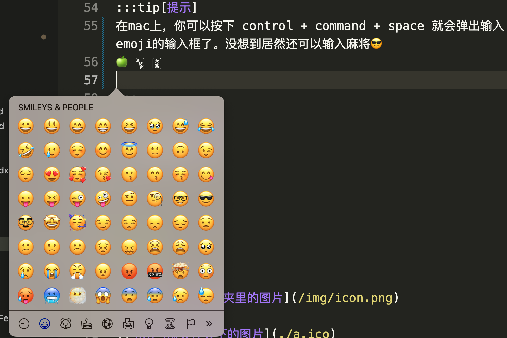

# Markdown 常用语法

## 换行
在行尾加上两个空格

```md
你好这句话比较长  
我需要换行
```
## 分段
两段之间加一个空行
```md
这是第一段

这是第二段
```

## 标题

```md
# 一级标题
## 二级标题
### 三级标题
```

## block

> This is block message
>> hi

```md
> This is block message
>> hi
```

## md block

```md
This is md block
```

````md
```md
This is md block
```
````

## 提示

:::tip[提示]
在mac上，你可以按下 control + command + space 就会弹出输入emoji的输入框了。没想到居然还可以输入麻将😎
🍏 🀦 🀌
:::

:::danger[告警]
出门记得关灯啊
:::

```md
:::tip[提示]
在mac上，你可以按下 control + command + space 就会弹出输入emoji的输入框了。没想到居然还可以输入麻将😎
🍏 🀦 🀌

:::

:::danger[告警]
出门记得关灯啊

:::
```

## 图片

```md



```


## 代码块

```jsx title="src/components/example.jsx"
function hello() {
    return <h1>Hello Markdown</hi>
}
```

````md
```jsx title="src/components/example.jsx"
function hello() {
    return <h1>Hello Markdown</hi>
}
```
````
